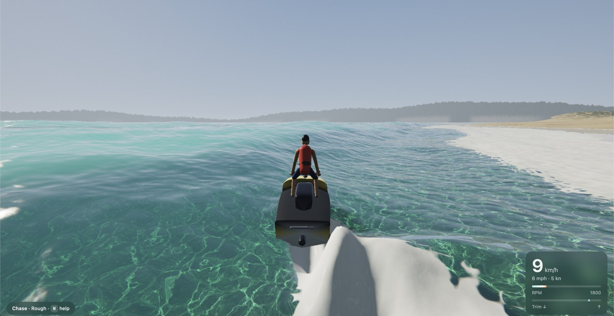
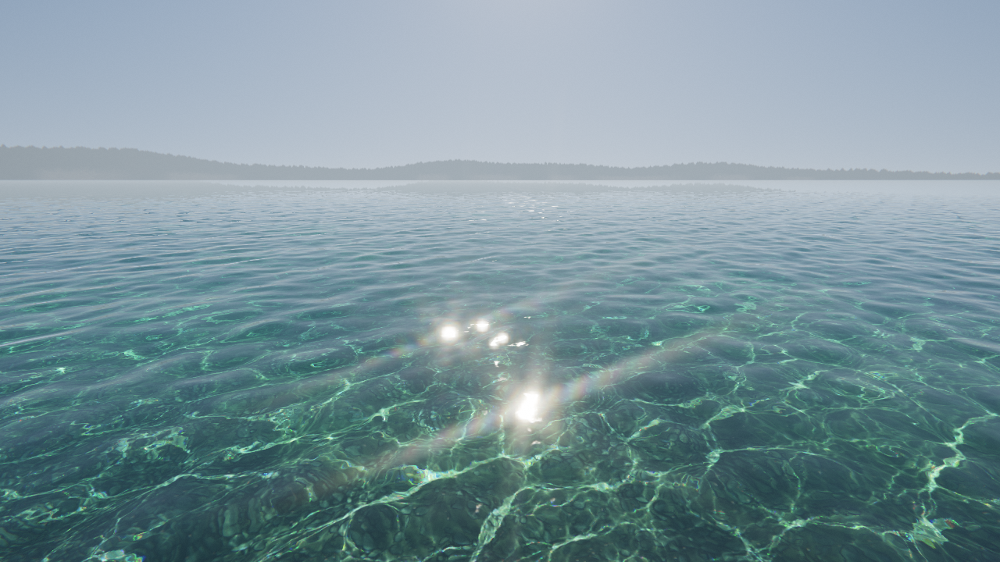

# Clear Runner

Clear Runner is a jetski game with real water physics, in a single HTML file. It is a fork of Clearwater Jetski and keeps all of it as **Free roam**, and adds a **Time Trial** on the eight Wave Race 64 courses, driven by Wave Race 64's own jetski physics and race rules, ported from the decompiled N64 cartridge. It uses WebGL2, with no libraries, no build step and no install, and it runs locally: open `index.html`.

## Play

Open `index.html` in a desktop browser (Chrome, Edge or Firefox) on a computer with a graphics card. It needs WebGL2 with float render targets. Pick **Free roam** or **Time Trial** on the start card, then click or press any key.

Graphics has four presets (Low, Medium, High, Ultra): the first run picks one automatically from the frame rate and then sticks with it, and the Graphics button or `G` switches and remembers your choice.

### Time Trial

Three laps of a Wave Race 64 course, alone against the clock. Choose the course, the layout (Normal, Hard, Expert: the buoy layouts of the game's three championship levels; Twilight City has no Normal layout), the machine (the game's four riders' machines, named here by how they handle) and its tuning (the game's grip, engine and steering settings, 0 to 11, centred by default).

- **Buoys.** Pass **red** buoys on their right (keep them on your left) and **yellow** buoys on their left. A green arrow floats over the next one and points to the side to take. Each buoy passed correctly adds a level of power (five is maximum power, extra thrust); a miss drains it to zero. Five misses disqualify you. If you slip past a buoy or through the wrong side of a gate, a yellow arrow points back at it: go back and take it, or carry on and it counts as a miss when you take the next one.
- **Falls.** Hit a wall, a buoy or a ramp's side hard at speed, or touch down on your side, and the rider is thrown off: the jetski slides away, the rider swims back and climbs on. Tap the throttle while they climb to get going sooner. A smaller knock makes the rider stagger with little thrust for a moment; let go of the throttle to find the balance sooner.
- **Stunts.** In the air above 60 km/h on the throttle, flick the stick from one side to the other for a barrel roll, back then forward for a dive, forward then back for a flip. Land one on its side and you fall.
- **Course out.** Leave the course area and a count from 10 starts; get back before it ends or you retire.
- **Timing.** Lap and total times like the game (1'23"45), timed to the millisecond at the line. Records, best lap and a split against your record's lap times are kept per course and layout.

| Control | Time Trial |
| --- | --- |
| `W` / `↑` / `Space` | Throttle (the N64's A button) |
| `A` / `D` or `←` / `→` | Steer (a virtual stick: taps give small corrections, and pressing the other way flicks it straight across, for stunts) |
| `S` / `↓` · `Q` | Lean back (nose up, for jumps) · lean forward (nose down) |
| `Shift` | Slide (R): the hull lets go sideways for tight turns |
| `E` | Crouch (B): the rider drops low and loads the hull |
| `R` · `C` · `H` | Restart · camera · menu (pauses the race) |
| Gamepad | Left stick steers and leans, A / RT throttle, RB / LT slide, B crouch, Y camera, Back restart, Start menu |
| Touch | Left stick (appears where your thumb lands, 360°): steer, lean fore/aft, flick for stunts · GAS pad (tap it to climb back on faster after a fall) · SLIDE and CROUCH pads, which throttle too (one thumb can't hold two pads) · **Restart**, **Camera** and **☰ Menu** buttons at the top right |

### Free roam

| Control | |
| --- | --- |
| `W` / `S` or `↑` / `↓` | Throttle / brake and reverse |
| `A` / `D` or `←` / `→` | Steer (the jet only steers under throttle, like a real one) |
| `Q` / `E` | Trim the nose down / up; pitch in the air |
| `Shift` | Attack stance: lean in hard for tighter turns |
| `C` | Chase / first-person camera |
| `G` | Graphics preset: low, medium, high, ultra |
| `V` | Water type: tropical (default), Mediterranean, coastal, murky (also on the start screen) |
| `T` | Time of day: day, full moon, retro dusk (also on the start screen, and a button on mobile) |
| `1`–`5` | Sea state: glassy, light chop, choppy, rough, surf (big breaking waves) |
| `R` · `M` · `H` | Reset · mute · help |
| Mouse drag / wheel | Look around / zoom |
| Gamepad | Stick steers, RT gas, LT brake, Y camera, B reset |
| Touch | Left stick steers (and trims: push up for nose down, pull down for nose up), GAS pad throttles; **Sea**, **Camera** and **Gfx** buttons at the top right; **☰ Menu** for the menu; a **Flip upright** button appears when you capsize |

Free roam offers two jetskis: the **stand-up racer** (160 hp, ridden standing and leaned hard) and the **sit-down cruiser** (300 hp, seated, faster and more stable). Time Trial rides the stand-up racer, as Wave Race 64 does.

**Things to try**
- **Jump the surf.** Turn around and head for the beach. Wait just outside the white water for a set (a bigger wave arrives every seventh), then ride out straight into it at full throttle.
- **Jump your own wake.** Carve a tight circle at speed and cross back over the waves you made.
- **Park on the beach.** Ride up onto the sand. With the ski beached, `W` / `S` walk it forward or back into the water.

## Time Trial: Wave Race 64, read from the cartridge

Everything in the Time Trial comes from the Wave Race 64 (USA, Rev A) analysis in `../wr64code` (the decompilation, the disassembly and `wr64-physics-findings.md`), not from memory of the game. The function names below are the ROM's.

- **The jetski is 12 particles, not a rigid body** (`func_80064C0C`, `func_8004B1B4`): a 72 × 24 × 21 unit V-hull of four triangular ribs held by 66 distance constraints. Each sub-step: the jet adds an impulse to the two stern chine particles, vectored by the steering angle (so the hull yaws because its stern is pushed sideways, like a real pump jet), gravity acts on the chines, the stern's sideways slip banks the hull into the turn, buoyancy adds a depth-proportional impulse to each submerged particle (clamped), the keel damps side slip and heave but keeps speed along the heading, then Euler integration (dt 0.992), one constraint pass, and the craft is the mean of the particles.
- **The game's clock and units.** A Time Trial runs at 20 frames a second with five physics sub-steps a frame (100 Hz), and 40 units make a metre: the game's speedometer shows the units moved per frame × 1.8 as km/h. The speedometer here is that same readout.
- **Per-machine tables** (thrust curve, full-power boost, steering lock and its low-speed boost, grip, banking, particle weights, how heavy it falls) are the ROM's, and the tuning sliders lerp them exactly as the game does. The stick goes through the game's response curve (a squared response, 0–70).
- **Obstacles.** Buoys are bumpable and spring back to their anchors; the pink marker buoys along the edges are bumpable too. Route markers and the CPU riders' line are not obstacles.
- **The race rules** (`func_8007687C`): the side you pass a buoy on is decided when you cross the line through it; a correct pass adds power (5 max, extra thrust), a miss starts a 0.8 s drain to zero and counts toward the 5 misses; crossings only count within the buoy's zone (in the game you must go back and recross; Clear Runner also lets you carry on and writes the skipped ones off as misses, so the race can't stall); lap times are interpolated inside the frame. Course out (`func_801F1CFC`), the start grid 12.8 m behind the line, the buoys that float on springs and can be bumped, and the start-gate pylons are the game's too.
- **The courses.** Each course's buoy route for all three layouts, its course area, its zones and its wall outlines were read out of the course data segments. The wall outlines are the game's collision walls here too, and they are baked into the terrain as shores: sandy islands, dunes and pines for the natural courses, and for Port Blue, Marine Fortress and Twilight City modelled stone quay walls (block courses, an algae band at the waterline, a coping slab). The courses sit on a clear, sandy floor 6 m down. The waves use the course's wave level, mapped onto the ocean's sea states. Sunset Bay races at dusk and Twilight City by moonlight.
- **Falls** (`func_8005DE24`'s rider states, `func_80061184`, `func_80063C88`). Each frame the collision code records the hardest closing speed per kind of obstacle (buoys, gate pylons and marker buoys, walls, boxes and ramps, props), and each machine has its own limits. Above 40 km/h, past the limit, or touching the water rolled past about 65°, the rider is thrown off: five frames with the controls dead while the hull is let loose (it slides on with its sideways grip gone), then the rider is in the water until the hull settles or 1.25 s pass, then climbs back on (77 frames, the controls back from frame 56, each press or release of the throttle skipping a frame). A smaller knock is a stagger, thrust × 0.3 until 2 s pass, or 0.55 s once the throttle is let go or the craft is slow; a light buoy knock or riding rolled past about 60° is a wobble with less grip. B is the game's crouch: gravity × 1.75, easing back over 10 frames while held.
- **Ramps, stunts, the rider's balance.** Each course's ramps and structures are built from the game's own oriented collision boxes (the boxes are also what you see), with the game's box response (softer on ramps). Stunts are the game's: in the air above 60 km/h on the throttle, snap the stick from one side to full on the other within 3 frames for a barrel roll (either way), back-to-forward for a dive, forward-to-back for a flip; hold it to keep turning. The rider's balance filters (side lean from the stern's slip, a crouch spring, a fore/aft shift) are the game's, and they set the direction of the fore/aft lean push.
- **The water is the game's.** Wave Race 64 simulates only a hexagon about 38 m across ahead of the camera: a 1-second source at its far edge paints rolls you then ride into, each course's swell generators send big crests through fixed zones, your wake is a trough carved into the same field, and the course starts from random bumps. Clearwater renders it and adds calm fine detail.
- **Scenery props.** Where each prop stands, which ones float and which ones you can hit come from the course's object list and the game's object classes; the models are Clear Runner's own, after what the courses show: palms, canopy tents, chevron boards, banner fences and flags on Sunny Beach's sandbar, driftwood on Drake Lake (more on Expert), floating mines and wreckage at Marine Fortress, oil drums in Port Blue, rocks off Southern Island. Mines and drums bob and get pushed aside; rocks and wreckage don't give. Race buoys carry a block R (red) or L (yellow), as the game's do.
- **What's new.** The jetski, rider (including how a fall looks: thrown clear, swimming back, climbing on), spray, foam and camera are Clear Runner's; buoys, gates, ramps, props and the arrow are modern models (no game assets). Not ported: the CPU riders and the rider's keyframe animation (Clear Runner's rider is posed from the game's balance values instead).

## How Free roam works (Clearwater Jetski)

- **Ocean.** Two FFT wave cascades run on the CPU: a JONSWAP wind sea plus swell, at 256 m and 27 m. The physics and the renderer use the same heights, so the waves you see are the waves you hit. Clearwater's GPU cascade adds fine detail. The surface is choppy: water is displaced sideways as well as up and down, giving sharp crests and flat troughs (the physics inverts the displacement, so it rides the same surface). Whitecaps appear where the surface is compressed (the Jacobian of the displacement) and leave foam that drifts and fades. Waves damp over shallows.
- **Surf.** A long-period swell shoals over the beach profile using linear finite-depth theory (tabulated and shared with the shader). Sets arrive every seventh wave; on the Surf setting set waves reach ~5 m crests (7 m faces). As a wave nears its break point (height ~0.8 × depth) its front compresses into a steep, glassy face of up to ~75° and the chop on it calms. Big waves plunge: from the moment the face goes vertical, the lip throws forward 0.35–0.6 × the wave height and lands in the trough ~0.22 wave periods later, forming a barrel. It's drawn as a clear-water sheet (a heightfield can't overhang) you see the face through, glowing turquoise when backlit. The breaking stage is one shared function, so the lip, the feathering on the crest, the white landing band, the splash-up and the rolling bore stay in step, and breaking peels along the crest from the peaks. Bores dump again on the sand as a shorebreak. Swell hitting the island rocks bursts into spray.
- **Jetski physics.** Two craft share the hydrodynamics: a stand-up race ski (2.55 m hull with the rider standing in a recessed tray, 160 hp, 330 kg with the rider) and a sit-down cruiser (3.3 m, 300 hp, 430 kg), each a rigid body with its own hull, pump and rider handling. Every triangle of the hull gets hydrostatic pressure, hydrodynamic pressure and suction, plus skin friction. Planing, porpoising, slamming and airtime all come out of that model. The jet pump vectors its thrust to steer and loses grip when the intake leaves the water. Keel and sponson foils give the hull its bite, and the rider balances, leans into turns, hikes out hard against being tipped past their lean and soaks up pitching with their knees. In the air the rider flies the ski level with the nose slightly up for landing (`Q`/`E` adjust it), and if it does capsize they climb back on and roll it upright after about a second. The tray is part of the hull shape, so water in it pushes the ski down.
- **Wake and impacts.** A dispersive wave solver in Fourier space (eWave-style, exact deep-water dispersion `ω = √(gk)`) runs in a window that follows the ski, driven by the hull's lift over its swept footprint (capped at 1.3× the craft's weight), so you get a Kelvin V wake and bow waves. The local waves are kept physical: slopes are limited to breaking steepness and heights soft-capped at ~1 m, and the removed energy turns into foam, never spikes. Slams after a jump follow Wagner/von Kármán impact physics: root jets and side sheets leave the chines at 1.2–2× the impact speed, 20–45° above the water, a crown splash follows at 35–70°, droplet counts scale with impact energy, and a small ring wave and a spreading foam ring go into the wake. Burying the bow in a wave bursts green water over the hood. Carving throws a sheet of spray off the stern's outer edge. The jet churns a white foam trail about a hull wide that widens through turns (a donut leaves a ring), thins into lace and fades over several seconds, over a milky turquoise cloud of bubbles that lasts longer. Spray landing back on the water leaves foam where it falls. Wake heights are read back each frame so the ski rides its own wake.
- **World.** A sandy beach with swash, wet sand, a strand line and dunes, backed by wooded hills. The bay floor deepens offshore, and there are rocky islands with pebble coves. The terrain uses the same formula in JS and GLSL, so collisions match what you see.
- **Rendering.** Clearwater's water shading (Fresnel, absorption, refracted caustics, sun glints, lens glare) extended with a combined water/terrain ray march. Water colour comes from ocean optics: pure-water absorption plus chlorophyll, dissolved organics and sediment, in four presets (tropical by default). The bay is a clear, sandy 14 m deep, and the water is thinned to about a third of real seawater's absorption and scattering, so the seabed, its caustics and seagrass show through clear turquoise water everywhere, not just by the shore. There's no milky glow, and the sky is a deep, clear-day blue with little haze and scattered fair-weather clouds. Three times of day share one lighting model: a clear day; a full-moon night (a big moon with maria, stars, moonlight glittering on the water, exposed like the eye adapts so the waves, wake and foam still read); and a retro dusk, a violet sky with a big banded sun on the horizon. Distant water is close to a mirror, so the hills, islands and far headland show upside down in it (Medium and up; the far headland on every setting), and FXAA smooths edges (Medium and up). Foam and spray use textures generated procedurally at start-up. Also a modelled jetski and animated rider, and a synthesized engine sound.

| URL option | Effect |
| --- | --- |
| `?debug` | Frame rate, resolution, jetski state |
| `?fp` | Start in first person |
| `?wake=512` | Force the finer wake grid (Ultra uses it; the default is 256²) |
| `?view=wake` / `?view=surf` | Debug maps of the wake and surf height fields |
| `?craft=sit` / `?craft=stand` | Start on a specific jetski |
| `?course=sunny` (`sunset`, `fortress`, `drake`, `port`, `twilight`, `glacier`, `southern`) | Time Trial on that course; `&diff=hard`, `&rider=0`–`3` |
| `?auto` | Autopilot (in Time Trial it follows the buoys) |
| `?water=0`–`3` | Water type |
| `?scene=0`–`2` | Time of day: day, full moon, retro dusk |
| `?noaa` | Turn off anti-aliasing |
| `?bench` | Log the GPU time of each render stage to the console |

## Clearwater

Clearwater is Aurélien's real-time, photoreal shallow-water renderer: FFT waves, refracted light caustics with dispersion, physically based Fresnel and sun glints, lens-diffraction glare and interactive ripples. The original lives in the [upstream repository](https://github.com/Aureliengmz/clearwater), with its own [live demo](https://aureliengmz.github.io/clearwater/).

The seabed texture is base64 in `<script id="pebbles-texture">` at the end of `index.html`. To regenerate it, run `python tools/make_pebbles.py` (needs numpy, scipy and pillow).

## References

- Jerry Tessendorf, *Simulating Ocean Water*: FFT waves
- Jerry Tessendorf, *eWave: Using an Exponential Solver on the iWave Problem*: the wake solver
- Jacob Kerner, *Water interaction model for boats in video games*: per-panel hull forces
- Evan Wallace, *WebGL Water*: refracted-grid caustics
- Inigo Quilez, *Texture repetition*: seabed tiling
- Marc Olano & Dan Baker, *LEAN Mapping*: distant highlights

## Credits

The water renderer is Clearwater, made by [Aurélien](https://x.com/Aurelien_Gz) at [Lumaris](https://lumaris.works). Clear Runner is a fork of Clearwater Jetski, which is built on top of it.

Wave Race 64 is © 1996 Nintendo. The Time Trial's course layouts and physics constants were read from the cartridge analysis in `../wr64code` for this local, non-commercial project; no game assets (models, textures, sounds) are used. The analysis tools and the ROM itself live in `../wr64code` and are not part of this project.

MIT License, see [LICENSE](LICENSE).
